# Noise Previews

ContinuousNoise wrapping (CellularNoise with seed 1 and noise type DISTANCE), with frequency 0.0625, 1 octaves, and mode FBM: 

ContinuousNoise wrapping (CellularNoise with seed 1 and noise type DISTANCE), with frequency 0.0625, 2 octaves, and mode FBM: 

ContinuousNoise wrapping (CellularNoise with seed 1 and noise type DISTANCE), with frequency 0.0625, 3 octaves, and mode FBM: 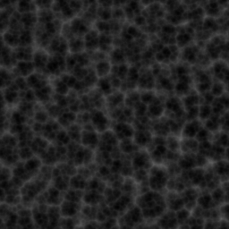

ContinuousNoise wrapping (CellularNoise with seed 1 and noise type DISTANCE), with frequency 0.0625, 1 octaves, and mode Billow: 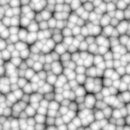

ContinuousNoise wrapping (CellularNoise with seed 1 and noise type DISTANCE), with frequency 0.0625, 2 octaves, and mode Billow: 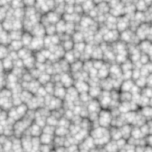

ContinuousNoise wrapping (CellularNoise with seed 1 and noise type DISTANCE), with frequency 0.0625, 3 octaves, and mode Billow: 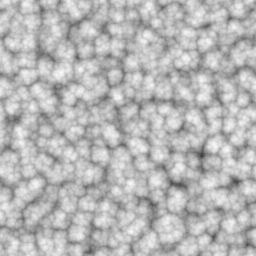

ContinuousNoise wrapping (CellularNoise with seed 1 and noise type DISTANCE), with frequency 0.0625, 1 octaves, and mode Ridged: 

ContinuousNoise wrapping (CellularNoise with seed 1 and noise type DISTANCE), with frequency 0.0625, 2 octaves, and mode Ridged: 

ContinuousNoise wrapping (CellularNoise with seed 1 and noise type DISTANCE), with frequency 0.0625, 3 octaves, and mode Ridged: 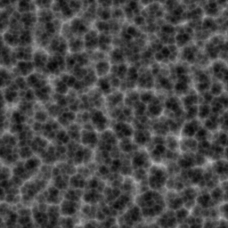

ContinuousNoise wrapping (CellularNoise with seed 1 and noise type DISTANCE), with frequency 0.0625, 1 octaves, and mode Warp: 

ContinuousNoise wrapping (CellularNoise with seed 1 and noise type DISTANCE), with frequency 0.0625, 2 octaves, and mode Warp: 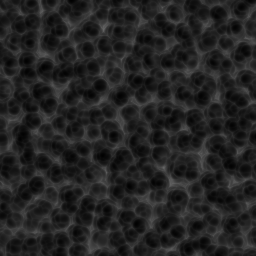

ContinuousNoise wrapping (CellularNoise with seed 1 and noise type DISTANCE), with frequency 0.0625, 3 octaves, and mode Warp: 

ContinuousNoise wrapping (CellularNoise with seed 1 and noise type DISTANCE), with frequency 0.0625, 1 octaves, and mode Exo: 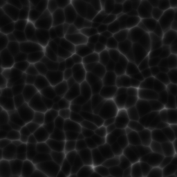

ContinuousNoise wrapping (CellularNoise with seed 1 and noise type DISTANCE), with frequency 0.0625, 2 octaves, and mode Exo: 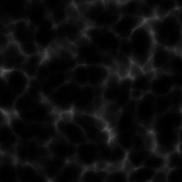

ContinuousNoise wrapping (CellularNoise with seed 1 and noise type DISTANCE), with frequency 0.0625, 3 octaves, and mode Exo: 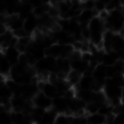

ContinuousNoise wrapping (CyclicNoise with seed 1, frequency 2.0,  and 3 internal octaves), with frequency 0.0625, 1 octaves, and mode FBM: 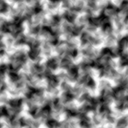

ContinuousNoise wrapping (CyclicNoise with seed 1, frequency 2.0,  and 3 internal octaves), with frequency 0.0625, 2 octaves, and mode FBM: 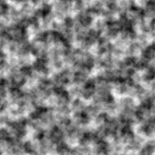

ContinuousNoise wrapping (CyclicNoise with seed 1, frequency 2.0,  and 3 internal octaves), with frequency 0.0625, 3 octaves, and mode FBM: 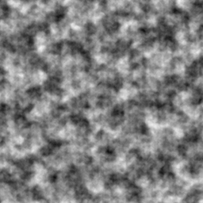

ContinuousNoise wrapping (CyclicNoise with seed 1, frequency 2.0,  and 3 internal octaves), with frequency 0.0625, 1 octaves, and mode Billow: 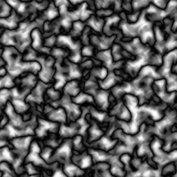

ContinuousNoise wrapping (CyclicNoise with seed 1, frequency 2.0,  and 3 internal octaves), with frequency 0.0625, 2 octaves, and mode Billow: 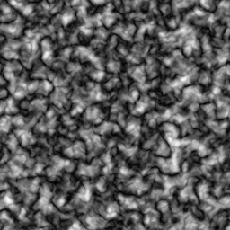

ContinuousNoise wrapping (CyclicNoise with seed 1, frequency 2.0,  and 3 internal octaves), with frequency 0.0625, 3 octaves, and mode Billow: 

ContinuousNoise wrapping (CyclicNoise with seed 1, frequency 2.0,  and 3 internal octaves), with frequency 0.0625, 1 octaves, and mode Ridged: 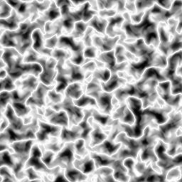

ContinuousNoise wrapping (CyclicNoise with seed 1, frequency 2.0,  and 3 internal octaves), with frequency 0.0625, 2 octaves, and mode Ridged: 

ContinuousNoise wrapping (CyclicNoise with seed 1, frequency 2.0,  and 3 internal octaves), with frequency 0.0625, 3 octaves, and mode Ridged: 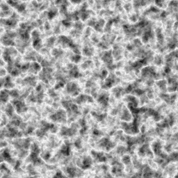

ContinuousNoise wrapping (CyclicNoise with seed 1, frequency 2.0,  and 3 internal octaves), with frequency 0.0625, 1 octaves, and mode Warp: 

ContinuousNoise wrapping (CyclicNoise with seed 1, frequency 2.0,  and 3 internal octaves), with frequency 0.0625, 2 octaves, and mode Warp: 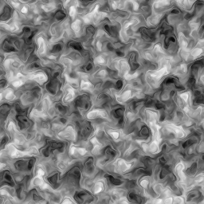

ContinuousNoise wrapping (CyclicNoise with seed 1, frequency 2.0,  and 3 internal octaves), with frequency 0.0625, 3 octaves, and mode Warp: 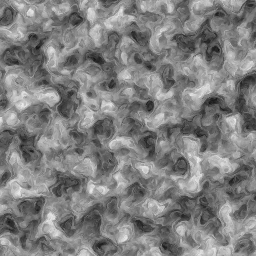

ContinuousNoise wrapping (CyclicNoise with seed 1, frequency 2.0,  and 3 internal octaves), with frequency 0.0625, 1 octaves, and mode Exo: 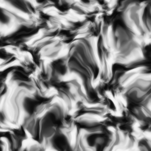

ContinuousNoise wrapping (CyclicNoise with seed 1, frequency 2.0,  and 3 internal octaves), with frequency 0.0625, 2 octaves, and mode Exo: 

ContinuousNoise wrapping (CyclicNoise with seed 1, frequency 2.0,  and 3 internal octaves), with frequency 0.0625, 3 octaves, and mode Exo: 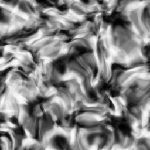

ContinuousNoise wrapping (FoamNoise with seed 1), with frequency 0.0625, 1 octaves, and mode FBM: 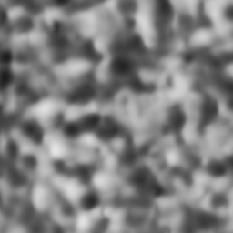

ContinuousNoise wrapping (FoamNoise with seed 1), with frequency 0.0625, 2 octaves, and mode FBM: 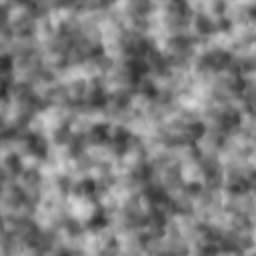

ContinuousNoise wrapping (FoamNoise with seed 1), with frequency 0.0625, 3 octaves, and mode FBM: 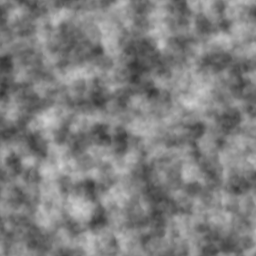

ContinuousNoise wrapping (FoamNoise with seed 1), with frequency 0.0625, 1 octaves, and mode Billow: 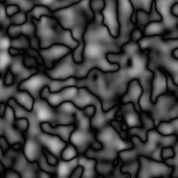

ContinuousNoise wrapping (FoamNoise with seed 1), with frequency 0.0625, 2 octaves, and mode Billow: 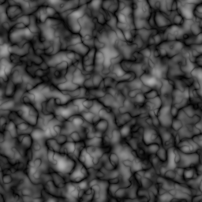

ContinuousNoise wrapping (FoamNoise with seed 1), with frequency 0.0625, 3 octaves, and mode Billow: 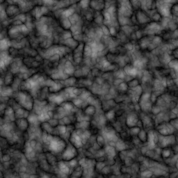

ContinuousNoise wrapping (FoamNoise with seed 1), with frequency 0.0625, 1 octaves, and mode Ridged: 

ContinuousNoise wrapping (FoamNoise with seed 1), with frequency 0.0625, 2 octaves, and mode Ridged: 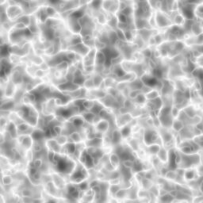

ContinuousNoise wrapping (FoamNoise with seed 1), with frequency 0.0625, 3 octaves, and mode Ridged: 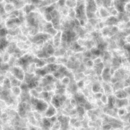

ContinuousNoise wrapping (FoamNoise with seed 1), with frequency 0.0625, 1 octaves, and mode Warp: 

ContinuousNoise wrapping (FoamNoise with seed 1), with frequency 0.0625, 2 octaves, and mode Warp: 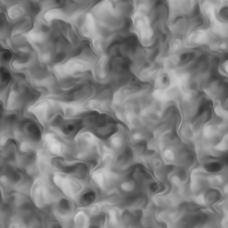

ContinuousNoise wrapping (FoamNoise with seed 1), with frequency 0.0625, 3 octaves, and mode Warp: 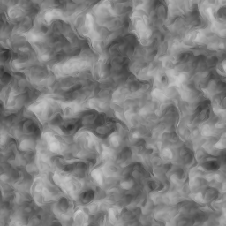

ContinuousNoise wrapping (FoamNoise with seed 1), with frequency 0.0625, 1 octaves, and mode Exo: 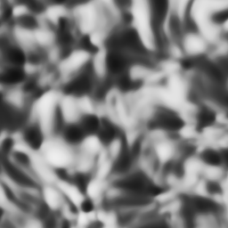

ContinuousNoise wrapping (FoamNoise with seed 1), with frequency 0.0625, 2 octaves, and mode Exo: 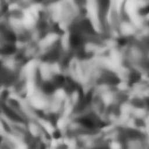

ContinuousNoise wrapping (FoamNoise with seed 1), with frequency 0.0625, 3 octaves, and mode Exo: 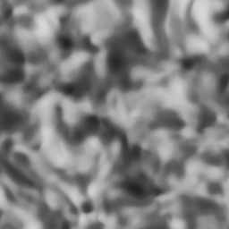

ContinuousNoise wrapping (HoneyNoise with seed 1), with frequency 0.0625, 1 octaves, and mode FBM: 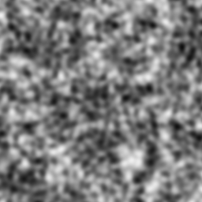

ContinuousNoise wrapping (HoneyNoise with seed 1), with frequency 0.0625, 2 octaves, and mode FBM: 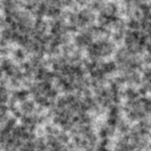

ContinuousNoise wrapping (HoneyNoise with seed 1), with frequency 0.0625, 3 octaves, and mode FBM: 

ContinuousNoise wrapping (HoneyNoise with seed 1), with frequency 0.0625, 1 octaves, and mode Billow: 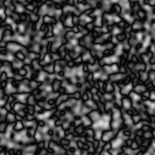

ContinuousNoise wrapping (HoneyNoise with seed 1), with frequency 0.0625, 2 octaves, and mode Billow: 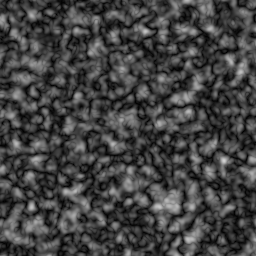

ContinuousNoise wrapping (HoneyNoise with seed 1), with frequency 0.0625, 3 octaves, and mode Billow: 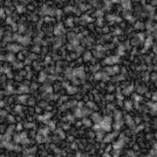

ContinuousNoise wrapping (HoneyNoise with seed 1), with frequency 0.0625, 1 octaves, and mode Ridged: 

ContinuousNoise wrapping (HoneyNoise with seed 1), with frequency 0.0625, 2 octaves, and mode Ridged: 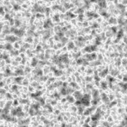

ContinuousNoise wrapping (HoneyNoise with seed 1), with frequency 0.0625, 3 octaves, and mode Ridged: 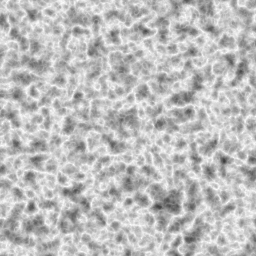

ContinuousNoise wrapping (HoneyNoise with seed 1), with frequency 0.0625, 1 octaves, and mode Warp: 

ContinuousNoise wrapping (HoneyNoise with seed 1), with frequency 0.0625, 2 octaves, and mode Warp: 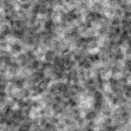

ContinuousNoise wrapping (HoneyNoise with seed 1), with frequency 0.0625, 3 octaves, and mode Warp: 

ContinuousNoise wrapping (HoneyNoise with seed 1), with frequency 0.0625, 1 octaves, and mode Exo: 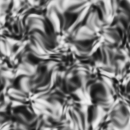

ContinuousNoise wrapping (HoneyNoise with seed 1), with frequency 0.0625, 2 octaves, and mode Exo: 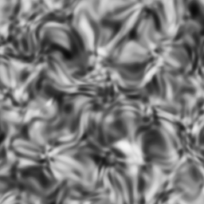

ContinuousNoise wrapping (HoneyNoise with seed 1), with frequency 0.0625, 3 octaves, and mode Exo: 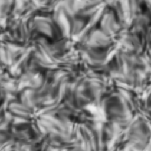

ContinuousNoise wrapping (PerlinNoise with seed 1), with frequency 0.0625, 1 octaves, and mode FBM: 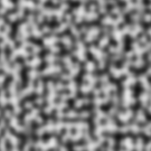

ContinuousNoise wrapping (PerlinNoise with seed 1), with frequency 0.0625, 2 octaves, and mode FBM: 

ContinuousNoise wrapping (PerlinNoise with seed 1), with frequency 0.0625, 3 octaves, and mode FBM: 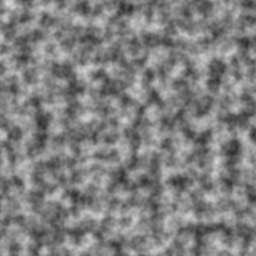

ContinuousNoise wrapping (PerlinNoise with seed 1), with frequency 0.0625, 1 octaves, and mode Billow: 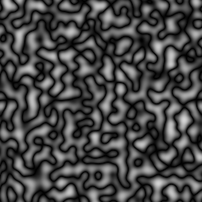

ContinuousNoise wrapping (PerlinNoise with seed 1), with frequency 0.0625, 2 octaves, and mode Billow: 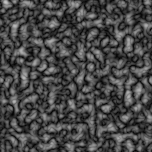

ContinuousNoise wrapping (PerlinNoise with seed 1), with frequency 0.0625, 3 octaves, and mode Billow: 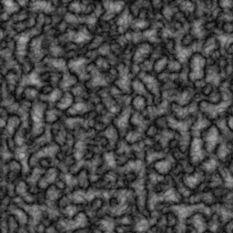

ContinuousNoise wrapping (PerlinNoise with seed 1), with frequency 0.0625, 1 octaves, and mode Ridged: 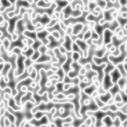

ContinuousNoise wrapping (PerlinNoise with seed 1), with frequency 0.0625, 2 octaves, and mode Ridged: 

ContinuousNoise wrapping (PerlinNoise with seed 1), with frequency 0.0625, 3 octaves, and mode Ridged: 

ContinuousNoise wrapping (PerlinNoise with seed 1), with frequency 0.0625, 1 octaves, and mode Warp: 

ContinuousNoise wrapping (PerlinNoise with seed 1), with frequency 0.0625, 2 octaves, and mode Warp: 

ContinuousNoise wrapping (PerlinNoise with seed 1), with frequency 0.0625, 3 octaves, and mode Warp: 

ContinuousNoise wrapping (PerlinNoise with seed 1), with frequency 0.0625, 1 octaves, and mode Exo: 

ContinuousNoise wrapping (PerlinNoise with seed 1), with frequency 0.0625, 2 octaves, and mode Exo: 

ContinuousNoise wrapping (PerlinNoise with seed 1), with frequency 0.0625, 3 octaves, and mode Exo: 

ContinuousNoise wrapping (PerlueNoise with seed 1), with frequency 0.0625, 1 octaves, and mode FBM: 

ContinuousNoise wrapping (PerlueNoise with seed 1), with frequency 0.0625, 2 octaves, and mode FBM: 

ContinuousNoise wrapping (PerlueNoise with seed 1), with frequency 0.0625, 3 octaves, and mode FBM: 

ContinuousNoise wrapping (PerlueNoise with seed 1), with frequency 0.0625, 1 octaves, and mode Billow: 

ContinuousNoise wrapping (PerlueNoise with seed 1), with frequency 0.0625, 2 octaves, and mode Billow: 

ContinuousNoise wrapping (PerlueNoise with seed 1), with frequency 0.0625, 3 octaves, and mode Billow: 

ContinuousNoise wrapping (PerlueNoise with seed 1), with frequency 0.0625, 1 octaves, and mode Ridged: 

ContinuousNoise wrapping (PerlueNoise with seed 1), with frequency 0.0625, 2 octaves, and mode Ridged: 

ContinuousNoise wrapping (PerlueNoise with seed 1), with frequency 0.0625, 3 octaves, and mode Ridged: 

ContinuousNoise wrapping (PerlueNoise with seed 1), with frequency 0.0625, 1 octaves, and mode Warp: 

ContinuousNoise wrapping (PerlueNoise with seed 1), with frequency 0.0625, 2 octaves, and mode Warp: 

ContinuousNoise wrapping (PerlueNoise with seed 1), with frequency 0.0625, 3 octaves, and mode Warp: 

ContinuousNoise wrapping (PerlueNoise with seed 1), with frequency 0.0625, 1 octaves, and mode Exo: 

ContinuousNoise wrapping (PerlueNoise with seed 1), with frequency 0.0625, 2 octaves, and mode Exo: 

ContinuousNoise wrapping (PerlueNoise with seed 1), with frequency 0.0625, 3 octaves, and mode Exo: 

ContinuousNoise wrapping (SimplexNoise with seed 1), with frequency 0.0625, 1 octaves, and mode FBM: 

ContinuousNoise wrapping (SimplexNoise with seed 1), with frequency 0.0625, 2 octaves, and mode FBM: 

ContinuousNoise wrapping (SimplexNoise with seed 1), with frequency 0.0625, 3 octaves, and mode FBM: 

ContinuousNoise wrapping (SimplexNoise with seed 1), with frequency 0.0625, 1 octaves, and mode Billow: 

ContinuousNoise wrapping (SimplexNoise with seed 1), with frequency 0.0625, 2 octaves, and mode Billow: 

ContinuousNoise wrapping (SimplexNoise with seed 1), with frequency 0.0625, 3 octaves, and mode Billow: 

ContinuousNoise wrapping (SimplexNoise with seed 1), with frequency 0.0625, 1 octaves, and mode Ridged: 

ContinuousNoise wrapping (SimplexNoise with seed 1), with frequency 0.0625, 2 octaves, and mode Ridged: 

ContinuousNoise wrapping (SimplexNoise with seed 1), with frequency 0.0625, 3 octaves, and mode Ridged: 

ContinuousNoise wrapping (SimplexNoise with seed 1), with frequency 0.0625, 1 octaves, and mode Warp: 

ContinuousNoise wrapping (SimplexNoise with seed 1), with frequency 0.0625, 2 octaves, and mode Warp: 

ContinuousNoise wrapping (SimplexNoise with seed 1), with frequency 0.0625, 3 octaves, and mode Warp: 

ContinuousNoise wrapping (SimplexNoise with seed 1), with frequency 0.0625, 1 octaves, and mode Exo: 

ContinuousNoise wrapping (SimplexNoise with seed 1), with frequency 0.0625, 2 octaves, and mode Exo: 

ContinuousNoise wrapping (SimplexNoise with seed 1), with frequency 0.0625, 3 octaves, and mode Exo: 

ContinuousNoise wrapping (SorbetNoise with seed 1, frequency 2.0,  and 3 internal octaves), with frequency 0.0625, 1 octaves, and mode FBM: 

ContinuousNoise wrapping (SorbetNoise with seed 1, frequency 2.0,  and 3 internal octaves), with frequency 0.0625, 2 octaves, and mode FBM: 

ContinuousNoise wrapping (SorbetNoise with seed 1, frequency 2.0,  and 3 internal octaves), with frequency 0.0625, 3 octaves, and mode FBM: 

ContinuousNoise wrapping (SorbetNoise with seed 1, frequency 2.0,  and 3 internal octaves), with frequency 0.0625, 1 octaves, and mode Billow: 

ContinuousNoise wrapping (SorbetNoise with seed 1, frequency 2.0,  and 3 internal octaves), with frequency 0.0625, 2 octaves, and mode Billow: 

ContinuousNoise wrapping (SorbetNoise with seed 1, frequency 2.0,  and 3 internal octaves), with frequency 0.0625, 3 octaves, and mode Billow: 

ContinuousNoise wrapping (SorbetNoise with seed 1, frequency 2.0,  and 3 internal octaves), with frequency 0.0625, 1 octaves, and mode Ridged: 

ContinuousNoise wrapping (SorbetNoise with seed 1, frequency 2.0,  and 3 internal octaves), with frequency 0.0625, 2 octaves, and mode Ridged: 

ContinuousNoise wrapping (SorbetNoise with seed 1, frequency 2.0,  and 3 internal octaves), with frequency 0.0625, 3 octaves, and mode Ridged: 

ContinuousNoise wrapping (SorbetNoise with seed 1, frequency 2.0,  and 3 internal octaves), with frequency 0.0625, 1 octaves, and mode Warp: 

ContinuousNoise wrapping (SorbetNoise with seed 1, frequency 2.0,  and 3 internal octaves), with frequency 0.0625, 2 octaves, and mode Warp: 

ContinuousNoise wrapping (SorbetNoise with seed 1, frequency 2.0,  and 3 internal octaves), with frequency 0.0625, 3 octaves, and mode Warp: 

ContinuousNoise wrapping (SorbetNoise with seed 1, frequency 2.0,  and 3 internal octaves), with frequency 0.0625, 1 octaves, and mode Exo: 

ContinuousNoise wrapping (SorbetNoise with seed 1, frequency 2.0,  and 3 internal octaves), with frequency 0.0625, 2 octaves, and mode Exo: 

ContinuousNoise wrapping (SorbetNoise with seed 1, frequency 2.0,  and 3 internal octaves), with frequency 0.0625, 3 octaves, and mode Exo: 

ContinuousNoise wrapping (ValueNoise with seed 1), with frequency 0.0625, 1 octaves, and mode FBM: 

ContinuousNoise wrapping (ValueNoise with seed 1), with frequency 0.0625, 2 octaves, and mode FBM: 

ContinuousNoise wrapping (ValueNoise with seed 1), with frequency 0.0625, 3 octaves, and mode FBM: 

ContinuousNoise wrapping (ValueNoise with seed 1), with frequency 0.0625, 1 octaves, and mode Billow: 

ContinuousNoise wrapping (ValueNoise with seed 1), with frequency 0.0625, 2 octaves, and mode Billow: 

ContinuousNoise wrapping (ValueNoise with seed 1), with frequency 0.0625, 3 octaves, and mode Billow: 

ContinuousNoise wrapping (ValueNoise with seed 1), with frequency 0.0625, 1 octaves, and mode Ridged: 

ContinuousNoise wrapping (ValueNoise with seed 1), with frequency 0.0625, 2 octaves, and mode Ridged: 

ContinuousNoise wrapping (ValueNoise with seed 1), with frequency 0.0625, 3 octaves, and mode Ridged: 

ContinuousNoise wrapping (ValueNoise with seed 1), with frequency 0.0625, 1 octaves, and mode Warp: 

ContinuousNoise wrapping (ValueNoise with seed 1), with frequency 0.0625, 2 octaves, and mode Warp: 

ContinuousNoise wrapping (ValueNoise with seed 1), with frequency 0.0625, 3 octaves, and mode Warp: 

ContinuousNoise wrapping (ValueNoise with seed 1), with frequency 0.0625, 1 octaves, and mode Exo: 

ContinuousNoise wrapping (ValueNoise with seed 1), with frequency 0.0625, 2 octaves, and mode Exo: 

ContinuousNoise wrapping (ValueNoise with seed 1), with frequency 0.0625, 3 octaves, and mode Exo: 
