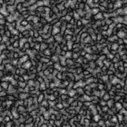
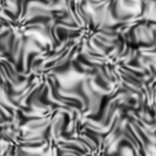
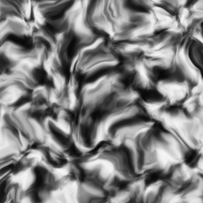

# Noise Previews

ContinuousNoise wrapping (CellularNoise with seed 1 and noise type DISTANCE), with frequency 0.0625, 1 octaves, and mode FBM: ([Animated GIF link](gif/_CellularNoise_1~2_~0.0625~0~1_.gif)) 

ContinuousNoise wrapping (CellularNoise with seed 1 and noise type DISTANCE), with frequency 0.0625, 2 octaves, and mode FBM: ([Animated GIF link](gif/_CellularNoise_1~2_~0.0625~0~2_.gif)) 

ContinuousNoise wrapping (CellularNoise with seed 1 and noise type DISTANCE), with frequency 0.0625, 3 octaves, and mode FBM: ([Animated GIF link](gif/_CellularNoise_1~2_~0.0625~0~3_.gif)) 

ContinuousNoise wrapping (CellularNoise with seed 1 and noise type DISTANCE), with frequency 0.0625, 1 octaves, and mode Billow: ([Animated GIF link](gif/_CellularNoise_1~2_~0.0625~1~1_.gif)) 

ContinuousNoise wrapping (CellularNoise with seed 1 and noise type DISTANCE), with frequency 0.0625, 2 octaves, and mode Billow: ([Animated GIF link](gif/_CellularNoise_1~2_~0.0625~1~2_.gif)) 

ContinuousNoise wrapping (CellularNoise with seed 1 and noise type DISTANCE), with frequency 0.0625, 3 octaves, and mode Billow: ([Animated GIF link](gif/_CellularNoise_1~2_~0.0625~1~3_.gif)) 

ContinuousNoise wrapping (CellularNoise with seed 1 and noise type DISTANCE), with frequency 0.0625, 1 octaves, and mode Ridged: ([Animated GIF link](gif/_CellularNoise_1~2_~0.0625~2~1_.gif)) 

ContinuousNoise wrapping (CellularNoise with seed 1 and noise type DISTANCE), with frequency 0.0625, 2 octaves, and mode Ridged: ([Animated GIF link](gif/_CellularNoise_1~2_~0.0625~2~2_.gif)) 

ContinuousNoise wrapping (CellularNoise with seed 1 and noise type DISTANCE), with frequency 0.0625, 3 octaves, and mode Ridged: ([Animated GIF link](gif/_CellularNoise_1~2_~0.0625~2~3_.gif)) 

ContinuousNoise wrapping (CellularNoise with seed 1 and noise type DISTANCE), with frequency 0.0625, 1 octaves, and mode Warp: ([Animated GIF link](gif/_CellularNoise_1~2_~0.0625~3~1_.gif)) 

ContinuousNoise wrapping (CellularNoise with seed 1 and noise type DISTANCE), with frequency 0.0625, 2 octaves, and mode Warp: ([Animated GIF link](gif/_CellularNoise_1~2_~0.0625~3~2_.gif)) 

ContinuousNoise wrapping (CellularNoise with seed 1 and noise type DISTANCE), with frequency 0.0625, 3 octaves, and mode Warp: ([Animated GIF link](gif/_CellularNoise_1~2_~0.0625~3~3_.gif)) 

ContinuousNoise wrapping (CellularNoise with seed 1 and noise type DISTANCE), with frequency 0.0625, 1 octaves, and mode Exo: ([Animated GIF link](gif/_CellularNoise_1~2_~0.0625~4~1_.gif)) 

ContinuousNoise wrapping (CellularNoise with seed 1 and noise type DISTANCE), with frequency 0.0625, 2 octaves, and mode Exo: ([Animated GIF link](gif/_CellularNoise_1~2_~0.0625~4~2_.gif)) 

ContinuousNoise wrapping (CellularNoise with seed 1 and noise type DISTANCE), with frequency 0.0625, 3 octaves, and mode Exo: ([Animated GIF link](gif/_CellularNoise_1~2_~0.0625~4~3_.gif)) 

ContinuousNoise wrapping (CyclicNoise with seed 1, frequency 2.0,  and 3 internal octaves), with frequency 0.0625, 1 octaves, and mode FBM: ([Animated GIF link](gif/_CyclicNoise_1~3~2.0_~0.0625~0~1_.gif)) 

ContinuousNoise wrapping (CyclicNoise with seed 1, frequency 2.0,  and 3 internal octaves), with frequency 0.0625, 2 octaves, and mode FBM: ([Animated GIF link](gif/_CyclicNoise_1~3~2.0_~0.0625~0~2_.gif)) 

ContinuousNoise wrapping (CyclicNoise with seed 1, frequency 2.0,  and 3 internal octaves), with frequency 0.0625, 3 octaves, and mode FBM: ([Animated GIF link](gif/_CyclicNoise_1~3~2.0_~0.0625~0~3_.gif)) 

ContinuousNoise wrapping (CyclicNoise with seed 1, frequency 2.0,  and 3 internal octaves), with frequency 0.0625, 1 octaves, and mode Billow: ([Animated GIF link](gif/_CyclicNoise_1~3~2.0_~0.0625~1~1_.gif)) 

ContinuousNoise wrapping (CyclicNoise with seed 1, frequency 2.0,  and 3 internal octaves), with frequency 0.0625, 2 octaves, and mode Billow: ([Animated GIF link](gif/_CyclicNoise_1~3~2.0_~0.0625~1~2_.gif)) 

ContinuousNoise wrapping (CyclicNoise with seed 1, frequency 2.0,  and 3 internal octaves), with frequency 0.0625, 3 octaves, and mode Billow: ([Animated GIF link](gif/_CyclicNoise_1~3~2.0_~0.0625~1~3_.gif)) 

ContinuousNoise wrapping (CyclicNoise with seed 1, frequency 2.0,  and 3 internal octaves), with frequency 0.0625, 1 octaves, and mode Ridged: ([Animated GIF link](gif/_CyclicNoise_1~3~2.0_~0.0625~2~1_.gif)) 

ContinuousNoise wrapping (CyclicNoise with seed 1, frequency 2.0,  and 3 internal octaves), with frequency 0.0625, 2 octaves, and mode Ridged: ([Animated GIF link](gif/_CyclicNoise_1~3~2.0_~0.0625~2~2_.gif)) 

ContinuousNoise wrapping (CyclicNoise with seed 1, frequency 2.0,  and 3 internal octaves), with frequency 0.0625, 3 octaves, and mode Ridged: ([Animated GIF link](gif/_CyclicNoise_1~3~2.0_~0.0625~2~3_.gif)) 

ContinuousNoise wrapping (CyclicNoise with seed 1, frequency 2.0,  and 3 internal octaves), with frequency 0.0625, 1 octaves, and mode Warp: ([Animated GIF link](gif/_CyclicNoise_1~3~2.0_~0.0625~3~1_.gif)) 

ContinuousNoise wrapping (CyclicNoise with seed 1, frequency 2.0,  and 3 internal octaves), with frequency 0.0625, 2 octaves, and mode Warp: ([Animated GIF link](gif/_CyclicNoise_1~3~2.0_~0.0625~3~2_.gif)) 

ContinuousNoise wrapping (CyclicNoise with seed 1, frequency 2.0,  and 3 internal octaves), with frequency 0.0625, 3 octaves, and mode Warp: ([Animated GIF link](gif/_CyclicNoise_1~3~2.0_~0.0625~3~3_.gif)) 

ContinuousNoise wrapping (CyclicNoise with seed 1, frequency 2.0,  and 3 internal octaves), with frequency 0.0625, 1 octaves, and mode Exo: ([Animated GIF link](gif/_CyclicNoise_1~3~2.0_~0.0625~4~1_.gif)) 

ContinuousNoise wrapping (CyclicNoise with seed 1, frequency 2.0,  and 3 internal octaves), with frequency 0.0625, 2 octaves, and mode Exo: ([Animated GIF link](gif/_CyclicNoise_1~3~2.0_~0.0625~4~2_.gif)) 

ContinuousNoise wrapping (CyclicNoise with seed 1, frequency 2.0,  and 3 internal octaves), with frequency 0.0625, 3 octaves, and mode Exo: ([Animated GIF link](gif/_CyclicNoise_1~3~2.0_~0.0625~4~3_.gif)) 

ContinuousNoise wrapping (FoamNoise with seed 1), with frequency 0.0625, 1 octaves, and mode FBM: ([Animated GIF link](gif/_FoamNoise_1_~0.0625~0~1_.gif)) 

ContinuousNoise wrapping (FoamNoise with seed 1), with frequency 0.0625, 2 octaves, and mode FBM: ([Animated GIF link](gif/_FoamNoise_1_~0.0625~0~2_.gif)) 

ContinuousNoise wrapping (FoamNoise with seed 1), with frequency 0.0625, 3 octaves, and mode FBM: ([Animated GIF link](gif/_FoamNoise_1_~0.0625~0~3_.gif)) 

ContinuousNoise wrapping (FoamNoise with seed 1), with frequency 0.0625, 1 octaves, and mode Billow: ([Animated GIF link](gif/_FoamNoise_1_~0.0625~1~1_.gif)) 

ContinuousNoise wrapping (FoamNoise with seed 1), with frequency 0.0625, 2 octaves, and mode Billow: ([Animated GIF link](gif/_FoamNoise_1_~0.0625~1~2_.gif)) 

ContinuousNoise wrapping (FoamNoise with seed 1), with frequency 0.0625, 3 octaves, and mode Billow: ([Animated GIF link](gif/_FoamNoise_1_~0.0625~1~3_.gif)) 

ContinuousNoise wrapping (FoamNoise with seed 1), with frequency 0.0625, 1 octaves, and mode Ridged: ([Animated GIF link](gif/_FoamNoise_1_~0.0625~2~1_.gif)) 

ContinuousNoise wrapping (FoamNoise with seed 1), with frequency 0.0625, 2 octaves, and mode Ridged: ([Animated GIF link](gif/_FoamNoise_1_~0.0625~2~2_.gif)) 

ContinuousNoise wrapping (FoamNoise with seed 1), with frequency 0.0625, 3 octaves, and mode Ridged: ([Animated GIF link](gif/_FoamNoise_1_~0.0625~2~3_.gif)) 

ContinuousNoise wrapping (FoamNoise with seed 1), with frequency 0.0625, 1 octaves, and mode Warp: ([Animated GIF link](gif/_FoamNoise_1_~0.0625~3~1_.gif)) 

ContinuousNoise wrapping (FoamNoise with seed 1), with frequency 0.0625, 2 octaves, and mode Warp: ([Animated GIF link](gif/_FoamNoise_1_~0.0625~3~2_.gif)) 

ContinuousNoise wrapping (FoamNoise with seed 1), with frequency 0.0625, 3 octaves, and mode Warp: ([Animated GIF link](gif/_FoamNoise_1_~0.0625~3~3_.gif)) 

ContinuousNoise wrapping (FoamNoise with seed 1), with frequency 0.0625, 1 octaves, and mode Exo: ([Animated GIF link](gif/_FoamNoise_1_~0.0625~4~1_.gif)) 

ContinuousNoise wrapping (FoamNoise with seed 1), with frequency 0.0625, 2 octaves, and mode Exo: ([Animated GIF link](gif/_FoamNoise_1_~0.0625~4~2_.gif)) 

ContinuousNoise wrapping (FoamNoise with seed 1), with frequency 0.0625, 3 octaves, and mode Exo: ([Animated GIF link](gif/_FoamNoise_1_~0.0625~4~3_.gif)) 

ContinuousNoise wrapping (HoneyNoise with seed 1), with frequency 0.0625, 1 octaves, and mode FBM: ([Animated GIF link](gif/_HoneyNoise_1_~0.0625~0~1_.gif)) 

ContinuousNoise wrapping (HoneyNoise with seed 1), with frequency 0.0625, 2 octaves, and mode FBM: ([Animated GIF link](gif/_HoneyNoise_1_~0.0625~0~2_.gif)) 

ContinuousNoise wrapping (HoneyNoise with seed 1), with frequency 0.0625, 3 octaves, and mode FBM: ([Animated GIF link](gif/_HoneyNoise_1_~0.0625~0~3_.gif)) 

ContinuousNoise wrapping (HoneyNoise with seed 1), with frequency 0.0625, 1 octaves, and mode Billow: ([Animated GIF link](gif/_HoneyNoise_1_~0.0625~1~1_.gif)) 

ContinuousNoise wrapping (HoneyNoise with seed 1), with frequency 0.0625, 2 octaves, and mode Billow: ([Animated GIF link](gif/_HoneyNoise_1_~0.0625~1~2_.gif)) 

ContinuousNoise wrapping (HoneyNoise with seed 1), with frequency 0.0625, 3 octaves, and mode Billow: ([Animated GIF link](gif/_HoneyNoise_1_~0.0625~1~3_.gif)) 

ContinuousNoise wrapping (HoneyNoise with seed 1), with frequency 0.0625, 1 octaves, and mode Ridged: ([Animated GIF link](gif/_HoneyNoise_1_~0.0625~2~1_.gif)) 

ContinuousNoise wrapping (HoneyNoise with seed 1), with frequency 0.0625, 2 octaves, and mode Ridged: ([Animated GIF link](gif/_HoneyNoise_1_~0.0625~2~2_.gif)) 

ContinuousNoise wrapping (HoneyNoise with seed 1), with frequency 0.0625, 3 octaves, and mode Ridged: ([Animated GIF link](gif/_HoneyNoise_1_~0.0625~2~3_.gif)) 

ContinuousNoise wrapping (HoneyNoise with seed 1), with frequency 0.0625, 1 octaves, and mode Warp: ([Animated GIF link](gif/_HoneyNoise_1_~0.0625~3~1_.gif)) 

ContinuousNoise wrapping (HoneyNoise with seed 1), with frequency 0.0625, 2 octaves, and mode Warp: ([Animated GIF link](gif/_HoneyNoise_1_~0.0625~3~2_.gif)) 

ContinuousNoise wrapping (HoneyNoise with seed 1), with frequency 0.0625, 3 octaves, and mode Warp: ([Animated GIF link](gif/_HoneyNoise_1_~0.0625~3~3_.gif)) 

ContinuousNoise wrapping (HoneyNoise with seed 1), with frequency 0.0625, 1 octaves, and mode Exo: ([Animated GIF link](gif/_HoneyNoise_1_~0.0625~4~1_.gif)) 

ContinuousNoise wrapping (HoneyNoise with seed 1), with frequency 0.0625, 2 octaves, and mode Exo: ([Animated GIF link](gif/_HoneyNoise_1_~0.0625~4~2_.gif)) 

ContinuousNoise wrapping (HoneyNoise with seed 1), with frequency 0.0625, 3 octaves, and mode Exo: ([Animated GIF link](gif/_HoneyNoise_1_~0.0625~4~3_.gif)) 

ContinuousNoise wrapping (OpenSimplex2FastNoise with seed 1), with frequency 0.0625, 1 octaves, and mode FBM: ([Animated GIF link](gif/_OpenSimplex2FastNoise_1_~0.0625~0~1_.gif)) 

ContinuousNoise wrapping (OpenSimplex2FastNoise with seed 1), with frequency 0.0625, 2 octaves, and mode FBM: ([Animated GIF link](gif/_OpenSimplex2FastNoise_1_~0.0625~0~2_.gif)) 

ContinuousNoise wrapping (OpenSimplex2FastNoise with seed 1), with frequency 0.0625, 3 octaves, and mode FBM: ([Animated GIF link](gif/_OpenSimplex2FastNoise_1_~0.0625~0~3_.gif)) 

ContinuousNoise wrapping (OpenSimplex2FastNoise with seed 1), with frequency 0.0625, 1 octaves, and mode Billow: ([Animated GIF link](gif/_OpenSimplex2FastNoise_1_~0.0625~1~1_.gif)) 

ContinuousNoise wrapping (OpenSimplex2FastNoise with seed 1), with frequency 0.0625, 2 octaves, and mode Billow: ([Animated GIF link](gif/_OpenSimplex2FastNoise_1_~0.0625~1~2_.gif)) 

ContinuousNoise wrapping (OpenSimplex2FastNoise with seed 1), with frequency 0.0625, 3 octaves, and mode Billow: ([Animated GIF link](gif/_OpenSimplex2FastNoise_1_~0.0625~1~3_.gif)) 

ContinuousNoise wrapping (OpenSimplex2FastNoise with seed 1), with frequency 0.0625, 1 octaves, and mode Ridged: ([Animated GIF link](gif/_OpenSimplex2FastNoise_1_~0.0625~2~1_.gif)) 

ContinuousNoise wrapping (OpenSimplex2FastNoise with seed 1), with frequency 0.0625, 2 octaves, and mode Ridged: ([Animated GIF link](gif/_OpenSimplex2FastNoise_1_~0.0625~2~2_.gif)) 

ContinuousNoise wrapping (OpenSimplex2FastNoise with seed 1), with frequency 0.0625, 3 octaves, and mode Ridged: ([Animated GIF link](gif/_OpenSimplex2FastNoise_1_~0.0625~2~3_.gif)) 

ContinuousNoise wrapping (OpenSimplex2FastNoise with seed 1), with frequency 0.0625, 1 octaves, and mode Warp: ([Animated GIF link](gif/_OpenSimplex2FastNoise_1_~0.0625~3~1_.gif)) 

ContinuousNoise wrapping (OpenSimplex2FastNoise with seed 1), with frequency 0.0625, 2 octaves, and mode Warp: ([Animated GIF link](gif/_OpenSimplex2FastNoise_1_~0.0625~3~2_.gif)) 

ContinuousNoise wrapping (OpenSimplex2FastNoise with seed 1), with frequency 0.0625, 3 octaves, and mode Warp: ([Animated GIF link](gif/_OpenSimplex2FastNoise_1_~0.0625~3~3_.gif)) 

ContinuousNoise wrapping (OpenSimplex2FastNoise with seed 1), with frequency 0.0625, 1 octaves, and mode Exo: ([Animated GIF link](gif/_OpenSimplex2FastNoise_1_~0.0625~4~1_.gif)) 

ContinuousNoise wrapping (OpenSimplex2FastNoise with seed 1), with frequency 0.0625, 2 octaves, and mode Exo: ([Animated GIF link](gif/_OpenSimplex2FastNoise_1_~0.0625~4~2_.gif)) 

ContinuousNoise wrapping (OpenSimplex2FastNoise with seed 1), with frequency 0.0625, 3 octaves, and mode Exo: ([Animated GIF link](gif/_OpenSimplex2FastNoise_1_~0.0625~4~3_.gif)) 

ContinuousNoise wrapping (OpenSimplex2SmoothNoise with seed 1), with frequency 0.0625, 1 octaves, and mode FBM: ([Animated GIF link](gif/_OpenSimplex2SmoothNoise_1_~0.0625~0~1_.gif)) 

ContinuousNoise wrapping (OpenSimplex2SmoothNoise with seed 1), with frequency 0.0625, 2 octaves, and mode FBM: ([Animated GIF link](gif/_OpenSimplex2SmoothNoise_1_~0.0625~0~2_.gif)) 

ContinuousNoise wrapping (OpenSimplex2SmoothNoise with seed 1), with frequency 0.0625, 3 octaves, and mode FBM: ([Animated GIF link](gif/_OpenSimplex2SmoothNoise_1_~0.0625~0~3_.gif)) 

ContinuousNoise wrapping (OpenSimplex2SmoothNoise with seed 1), with frequency 0.0625, 1 octaves, and mode Billow: ([Animated GIF link](gif/_OpenSimplex2SmoothNoise_1_~0.0625~1~1_.gif)) 

ContinuousNoise wrapping (OpenSimplex2SmoothNoise with seed 1), with frequency 0.0625, 2 octaves, and mode Billow: ([Animated GIF link](gif/_OpenSimplex2SmoothNoise_1_~0.0625~1~2_.gif)) 

ContinuousNoise wrapping (OpenSimplex2SmoothNoise with seed 1), with frequency 0.0625, 3 octaves, and mode Billow: ([Animated GIF link](gif/_OpenSimplex2SmoothNoise_1_~0.0625~1~3_.gif)) 

ContinuousNoise wrapping (OpenSimplex2SmoothNoise with seed 1), with frequency 0.0625, 1 octaves, and mode Ridged: ([Animated GIF link](gif/_OpenSimplex2SmoothNoise_1_~0.0625~2~1_.gif)) 

ContinuousNoise wrapping (OpenSimplex2SmoothNoise with seed 1), with frequency 0.0625, 2 octaves, and mode Ridged: ([Animated GIF link](gif/_OpenSimplex2SmoothNoise_1_~0.0625~2~2_.gif)) 

ContinuousNoise wrapping (OpenSimplex2SmoothNoise with seed 1), with frequency 0.0625, 3 octaves, and mode Ridged: ([Animated GIF link](gif/_OpenSimplex2SmoothNoise_1_~0.0625~2~3_.gif)) 

ContinuousNoise wrapping (OpenSimplex2SmoothNoise with seed 1), with frequency 0.0625, 1 octaves, and mode Warp: ([Animated GIF link](gif/_OpenSimplex2SmoothNoise_1_~0.0625~3~1_.gif)) 

ContinuousNoise wrapping (OpenSimplex2SmoothNoise with seed 1), with frequency 0.0625, 2 octaves, and mode Warp: ([Animated GIF link](gif/_OpenSimplex2SmoothNoise_1_~0.0625~3~2_.gif)) 

ContinuousNoise wrapping (OpenSimplex2SmoothNoise with seed 1), with frequency 0.0625, 3 octaves, and mode Warp: ([Animated GIF link](gif/_OpenSimplex2SmoothNoise_1_~0.0625~3~3_.gif)) 

ContinuousNoise wrapping (OpenSimplex2SmoothNoise with seed 1), with frequency 0.0625, 1 octaves, and mode Exo: ([Animated GIF link](gif/_OpenSimplex2SmoothNoise_1_~0.0625~4~1_.gif)) 

ContinuousNoise wrapping (OpenSimplex2SmoothNoise with seed 1), with frequency 0.0625, 2 octaves, and mode Exo: ([Animated GIF link](gif/_OpenSimplex2SmoothNoise_1_~0.0625~4~2_.gif)) 

ContinuousNoise wrapping (OpenSimplex2SmoothNoise with seed 1), with frequency 0.0625, 3 octaves, and mode Exo: ([Animated GIF link](gif/_OpenSimplex2SmoothNoise_1_~0.0625~4~3_.gif)) 

ContinuousNoise wrapping (PerlinNoise with seed 1), with frequency 0.0625, 1 octaves, and mode FBM: ([Animated GIF link](gif/_PerlinNoise_1_~0.0625~0~1_.gif)) 

ContinuousNoise wrapping (PerlinNoise with seed 1), with frequency 0.0625, 2 octaves, and mode FBM: ([Animated GIF link](gif/_PerlinNoise_1_~0.0625~0~2_.gif)) 

ContinuousNoise wrapping (PerlinNoise with seed 1), with frequency 0.0625, 3 octaves, and mode FBM: ([Animated GIF link](gif/_PerlinNoise_1_~0.0625~0~3_.gif)) 

ContinuousNoise wrapping (PerlinNoise with seed 1), with frequency 0.0625, 1 octaves, and mode Billow: ([Animated GIF link](gif/_PerlinNoise_1_~0.0625~1~1_.gif)) 

ContinuousNoise wrapping (PerlinNoise with seed 1), with frequency 0.0625, 2 octaves, and mode Billow: ([Animated GIF link](gif/_PerlinNoise_1_~0.0625~1~2_.gif)) 

ContinuousNoise wrapping (PerlinNoise with seed 1), with frequency 0.0625, 3 octaves, and mode Billow: ([Animated GIF link](gif/_PerlinNoise_1_~0.0625~1~3_.gif)) 

ContinuousNoise wrapping (PerlinNoise with seed 1), with frequency 0.0625, 1 octaves, and mode Ridged: ([Animated GIF link](gif/_PerlinNoise_1_~0.0625~2~1_.gif)) 

ContinuousNoise wrapping (PerlinNoise with seed 1), with frequency 0.0625, 2 octaves, and mode Ridged: ([Animated GIF link](gif/_PerlinNoise_1_~0.0625~2~2_.gif)) 

ContinuousNoise wrapping (PerlinNoise with seed 1), with frequency 0.0625, 3 octaves, and mode Ridged: ([Animated GIF link](gif/_PerlinNoise_1_~0.0625~2~3_.gif)) 

ContinuousNoise wrapping (PerlinNoise with seed 1), with frequency 0.0625, 1 octaves, and mode Warp: ([Animated GIF link](gif/_PerlinNoise_1_~0.0625~3~1_.gif)) 

ContinuousNoise wrapping (PerlinNoise with seed 1), with frequency 0.0625, 2 octaves, and mode Warp: ([Animated GIF link](gif/_PerlinNoise_1_~0.0625~3~2_.gif)) 

ContinuousNoise wrapping (PerlinNoise with seed 1), with frequency 0.0625, 3 octaves, and mode Warp: ([Animated GIF link](gif/_PerlinNoise_1_~0.0625~3~3_.gif)) 

ContinuousNoise wrapping (PerlinNoise with seed 1), with frequency 0.0625, 1 octaves, and mode Exo: ([Animated GIF link](gif/_PerlinNoise_1_~0.0625~4~1_.gif)) 

ContinuousNoise wrapping (PerlinNoise with seed 1), with frequency 0.0625, 2 octaves, and mode Exo: ([Animated GIF link](gif/_PerlinNoise_1_~0.0625~4~2_.gif)) 

ContinuousNoise wrapping (PerlinNoise with seed 1), with frequency 0.0625, 3 octaves, and mode Exo: ([Animated GIF link](gif/_PerlinNoise_1_~0.0625~4~3_.gif)) 

ContinuousNoise wrapping (PerlueNoise with seed 1), with frequency 0.0625, 1 octaves, and mode FBM: ([Animated GIF link](gif/_PerlueNoise_1_~0.0625~0~1_.gif)) 

ContinuousNoise wrapping (PerlueNoise with seed 1), with frequency 0.0625, 2 octaves, and mode FBM: ([Animated GIF link](gif/_PerlueNoise_1_~0.0625~0~2_.gif)) 

ContinuousNoise wrapping (PerlueNoise with seed 1), with frequency 0.0625, 3 octaves, and mode FBM: ([Animated GIF link](gif/_PerlueNoise_1_~0.0625~0~3_.gif)) 

ContinuousNoise wrapping (PerlueNoise with seed 1), with frequency 0.0625, 1 octaves, and mode Billow: ([Animated GIF link](gif/_PerlueNoise_1_~0.0625~1~1_.gif)) 

ContinuousNoise wrapping (PerlueNoise with seed 1), with frequency 0.0625, 2 octaves, and mode Billow: ([Animated GIF link](gif/_PerlueNoise_1_~0.0625~1~2_.gif)) 

ContinuousNoise wrapping (PerlueNoise with seed 1), with frequency 0.0625, 3 octaves, and mode Billow: ([Animated GIF link](gif/_PerlueNoise_1_~0.0625~1~3_.gif)) 

ContinuousNoise wrapping (PerlueNoise with seed 1), with frequency 0.0625, 1 octaves, and mode Ridged: ([Animated GIF link](gif/_PerlueNoise_1_~0.0625~2~1_.gif)) 

ContinuousNoise wrapping (PerlueNoise with seed 1), with frequency 0.0625, 2 octaves, and mode Ridged: ([Animated GIF link](gif/_PerlueNoise_1_~0.0625~2~2_.gif)) 

ContinuousNoise wrapping (PerlueNoise with seed 1), with frequency 0.0625, 3 octaves, and mode Ridged: ([Animated GIF link](gif/_PerlueNoise_1_~0.0625~2~3_.gif)) 

ContinuousNoise wrapping (PerlueNoise with seed 1), with frequency 0.0625, 1 octaves, and mode Warp: ([Animated GIF link](gif/_PerlueNoise_1_~0.0625~3~1_.gif)) 

ContinuousNoise wrapping (PerlueNoise with seed 1), with frequency 0.0625, 2 octaves, and mode Warp: ([Animated GIF link](gif/_PerlueNoise_1_~0.0625~3~2_.gif)) 

ContinuousNoise wrapping (PerlueNoise with seed 1), with frequency 0.0625, 3 octaves, and mode Warp: ([Animated GIF link](gif/_PerlueNoise_1_~0.0625~3~3_.gif)) 

ContinuousNoise wrapping (PerlueNoise with seed 1), with frequency 0.0625, 1 octaves, and mode Exo: ([Animated GIF link](gif/_PerlueNoise_1_~0.0625~4~1_.gif)) 

ContinuousNoise wrapping (PerlueNoise with seed 1), with frequency 0.0625, 2 octaves, and mode Exo: ([Animated GIF link](gif/_PerlueNoise_1_~0.0625~4~2_.gif)) 

ContinuousNoise wrapping (PerlueNoise with seed 1), with frequency 0.0625, 3 octaves, and mode Exo: ([Animated GIF link](gif/_PerlueNoise_1_~0.0625~4~3_.gif)) 

ContinuousNoise wrapping (SimplexNoise with seed 1), with frequency 0.0625, 1 octaves, and mode FBM: ([Animated GIF link](gif/_SimplexNoise_1_~0.0625~0~1_.gif)) 

ContinuousNoise wrapping (SimplexNoise with seed 1), with frequency 0.0625, 2 octaves, and mode FBM: ([Animated GIF link](gif/_SimplexNoise_1_~0.0625~0~2_.gif)) 

ContinuousNoise wrapping (SimplexNoise with seed 1), with frequency 0.0625, 3 octaves, and mode FBM: ([Animated GIF link](gif/_SimplexNoise_1_~0.0625~0~3_.gif)) 

ContinuousNoise wrapping (SimplexNoise with seed 1), with frequency 0.0625, 1 octaves, and mode Billow: ([Animated GIF link](gif/_SimplexNoise_1_~0.0625~1~1_.gif)) 

ContinuousNoise wrapping (SimplexNoise with seed 1), with frequency 0.0625, 2 octaves, and mode Billow: ([Animated GIF link](gif/_SimplexNoise_1_~0.0625~1~2_.gif)) 

ContinuousNoise wrapping (SimplexNoise with seed 1), with frequency 0.0625, 3 octaves, and mode Billow: ([Animated GIF link](gif/_SimplexNoise_1_~0.0625~1~3_.gif)) 

ContinuousNoise wrapping (SimplexNoise with seed 1), with frequency 0.0625, 1 octaves, and mode Ridged: ([Animated GIF link](gif/_SimplexNoise_1_~0.0625~2~1_.gif)) 

ContinuousNoise wrapping (SimplexNoise with seed 1), with frequency 0.0625, 2 octaves, and mode Ridged: ([Animated GIF link](gif/_SimplexNoise_1_~0.0625~2~2_.gif)) 

ContinuousNoise wrapping (SimplexNoise with seed 1), with frequency 0.0625, 3 octaves, and mode Ridged: ([Animated GIF link](gif/_SimplexNoise_1_~0.0625~2~3_.gif)) 

ContinuousNoise wrapping (SimplexNoise with seed 1), with frequency 0.0625, 1 octaves, and mode Warp: ([Animated GIF link](gif/_SimplexNoise_1_~0.0625~3~1_.gif)) 

ContinuousNoise wrapping (SimplexNoise with seed 1), with frequency 0.0625, 2 octaves, and mode Warp: ([Animated GIF link](gif/_SimplexNoise_1_~0.0625~3~2_.gif)) 

ContinuousNoise wrapping (SimplexNoise with seed 1), with frequency 0.0625, 3 octaves, and mode Warp: ([Animated GIF link](gif/_SimplexNoise_1_~0.0625~3~3_.gif)) 

ContinuousNoise wrapping (SimplexNoise with seed 1), with frequency 0.0625, 1 octaves, and mode Exo: ([Animated GIF link](gif/_SimplexNoise_1_~0.0625~4~1_.gif)) 

ContinuousNoise wrapping (SimplexNoise with seed 1), with frequency 0.0625, 2 octaves, and mode Exo: ([Animated GIF link](gif/_SimplexNoise_1_~0.0625~4~2_.gif)) 

ContinuousNoise wrapping (SimplexNoise with seed 1), with frequency 0.0625, 3 octaves, and mode Exo: ([Animated GIF link](gif/_SimplexNoise_1_~0.0625~4~3_.gif)) 

ContinuousNoise wrapping (SorbetNoise with seed 1, frequency 2.0,  and 3 internal octaves), with frequency 0.0625, 1 octaves, and mode FBM: ([Animated GIF link](gif/_SorbetNoise_1~3~2.0_~0.0625~0~1_.gif)) 

ContinuousNoise wrapping (SorbetNoise with seed 1, frequency 2.0,  and 3 internal octaves), with frequency 0.0625, 2 octaves, and mode FBM: ([Animated GIF link](gif/_SorbetNoise_1~3~2.0_~0.0625~0~2_.gif)) 

ContinuousNoise wrapping (SorbetNoise with seed 1, frequency 2.0,  and 3 internal octaves), with frequency 0.0625, 3 octaves, and mode FBM: ([Animated GIF link](gif/_SorbetNoise_1~3~2.0_~0.0625~0~3_.gif)) 

ContinuousNoise wrapping (SorbetNoise with seed 1, frequency 2.0,  and 3 internal octaves), with frequency 0.0625, 1 octaves, and mode Billow: ([Animated GIF link](gif/_SorbetNoise_1~3~2.0_~0.0625~1~1_.gif)) 

ContinuousNoise wrapping (SorbetNoise with seed 1, frequency 2.0,  and 3 internal octaves), with frequency 0.0625, 2 octaves, and mode Billow: ([Animated GIF link](gif/_SorbetNoise_1~3~2.0_~0.0625~1~2_.gif)) 

ContinuousNoise wrapping (SorbetNoise with seed 1, frequency 2.0,  and 3 internal octaves), with frequency 0.0625, 3 octaves, and mode Billow: ([Animated GIF link](gif/_SorbetNoise_1~3~2.0_~0.0625~1~3_.gif)) 

ContinuousNoise wrapping (SorbetNoise with seed 1, frequency 2.0,  and 3 internal octaves), with frequency 0.0625, 1 octaves, and mode Ridged: ([Animated GIF link](gif/_SorbetNoise_1~3~2.0_~0.0625~2~1_.gif)) 

ContinuousNoise wrapping (SorbetNoise with seed 1, frequency 2.0,  and 3 internal octaves), with frequency 0.0625, 2 octaves, and mode Ridged: ([Animated GIF link](gif/_SorbetNoise_1~3~2.0_~0.0625~2~2_.gif)) 

ContinuousNoise wrapping (SorbetNoise with seed 1, frequency 2.0,  and 3 internal octaves), with frequency 0.0625, 3 octaves, and mode Ridged: ([Animated GIF link](gif/_SorbetNoise_1~3~2.0_~0.0625~2~3_.gif)) 

ContinuousNoise wrapping (SorbetNoise with seed 1, frequency 2.0,  and 3 internal octaves), with frequency 0.0625, 1 octaves, and mode Warp: ([Animated GIF link](gif/_SorbetNoise_1~3~2.0_~0.0625~3~1_.gif)) 

ContinuousNoise wrapping (SorbetNoise with seed 1, frequency 2.0,  and 3 internal octaves), with frequency 0.0625, 2 octaves, and mode Warp: ([Animated GIF link](gif/_SorbetNoise_1~3~2.0_~0.0625~3~2_.gif)) 

ContinuousNoise wrapping (SorbetNoise with seed 1, frequency 2.0,  and 3 internal octaves), with frequency 0.0625, 3 octaves, and mode Warp: ([Animated GIF link](gif/_SorbetNoise_1~3~2.0_~0.0625~3~3_.gif)) 

ContinuousNoise wrapping (SorbetNoise with seed 1, frequency 2.0,  and 3 internal octaves), with frequency 0.0625, 1 octaves, and mode Exo: ([Animated GIF link](gif/_SorbetNoise_1~3~2.0_~0.0625~4~1_.gif)) 

ContinuousNoise wrapping (SorbetNoise with seed 1, frequency 2.0,  and 3 internal octaves), with frequency 0.0625, 2 octaves, and mode Exo: ([Animated GIF link](gif/_SorbetNoise_1~3~2.0_~0.0625~4~2_.gif)) 

ContinuousNoise wrapping (SorbetNoise with seed 1, frequency 2.0,  and 3 internal octaves), with frequency 0.0625, 3 octaves, and mode Exo: ([Animated GIF link](gif/_SorbetNoise_1~3~2.0_~0.0625~4~3_.gif)) 

ContinuousNoise wrapping (ValueNoise with seed 1), with frequency 0.0625, 1 octaves, and mode FBM: ([Animated GIF link](gif/_ValueNoise_1_~0.0625~0~1_.gif)) 

ContinuousNoise wrapping (ValueNoise with seed 1), with frequency 0.0625, 2 octaves, and mode FBM: ([Animated GIF link](gif/_ValueNoise_1_~0.0625~0~2_.gif)) 

ContinuousNoise wrapping (ValueNoise with seed 1), with frequency 0.0625, 3 octaves, and mode FBM: ([Animated GIF link](gif/_ValueNoise_1_~0.0625~0~3_.gif)) 

ContinuousNoise wrapping (ValueNoise with seed 1), with frequency 0.0625, 1 octaves, and mode Billow: ([Animated GIF link](gif/_ValueNoise_1_~0.0625~1~1_.gif)) 

ContinuousNoise wrapping (ValueNoise with seed 1), with frequency 0.0625, 2 octaves, and mode Billow: ([Animated GIF link](gif/_ValueNoise_1_~0.0625~1~2_.gif)) 

ContinuousNoise wrapping (ValueNoise with seed 1), with frequency 0.0625, 3 octaves, and mode Billow: ([Animated GIF link](gif/_ValueNoise_1_~0.0625~1~3_.gif)) 

ContinuousNoise wrapping (ValueNoise with seed 1), with frequency 0.0625, 1 octaves, and mode Ridged: ([Animated GIF link](gif/_ValueNoise_1_~0.0625~2~1_.gif)) 

ContinuousNoise wrapping (ValueNoise with seed 1), with frequency 0.0625, 2 octaves, and mode Ridged: ([Animated GIF link](gif/_ValueNoise_1_~0.0625~2~2_.gif)) 

ContinuousNoise wrapping (ValueNoise with seed 1), with frequency 0.0625, 3 octaves, and mode Ridged: ([Animated GIF link](gif/_ValueNoise_1_~0.0625~2~3_.gif)) 

ContinuousNoise wrapping (ValueNoise with seed 1), with frequency 0.0625, 1 octaves, and mode Warp: ([Animated GIF link](gif/_ValueNoise_1_~0.0625~3~1_.gif)) 

ContinuousNoise wrapping (ValueNoise with seed 1), with frequency 0.0625, 2 octaves, and mode Warp: ([Animated GIF link](gif/_ValueNoise_1_~0.0625~3~2_.gif)) 

ContinuousNoise wrapping (ValueNoise with seed 1), with frequency 0.0625, 3 octaves, and mode Warp: ([Animated GIF link](gif/_ValueNoise_1_~0.0625~3~3_.gif)) 

ContinuousNoise wrapping (ValueNoise with seed 1), with frequency 0.0625, 1 octaves, and mode Exo: ([Animated GIF link](gif/_ValueNoise_1_~0.0625~4~1_.gif)) 

ContinuousNoise wrapping (ValueNoise with seed 1), with frequency 0.0625, 2 octaves, and mode Exo: ([Animated GIF link](gif/_ValueNoise_1_~0.0625~4~2_.gif)) 

ContinuousNoise wrapping (ValueNoise with seed 1), with frequency 0.0625, 3 octaves, and mode Exo: ([Animated GIF link](gif/_ValueNoise_1_~0.0625~4~3_.gif)) 
